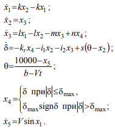
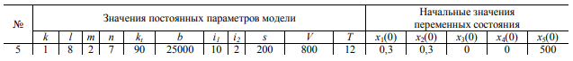
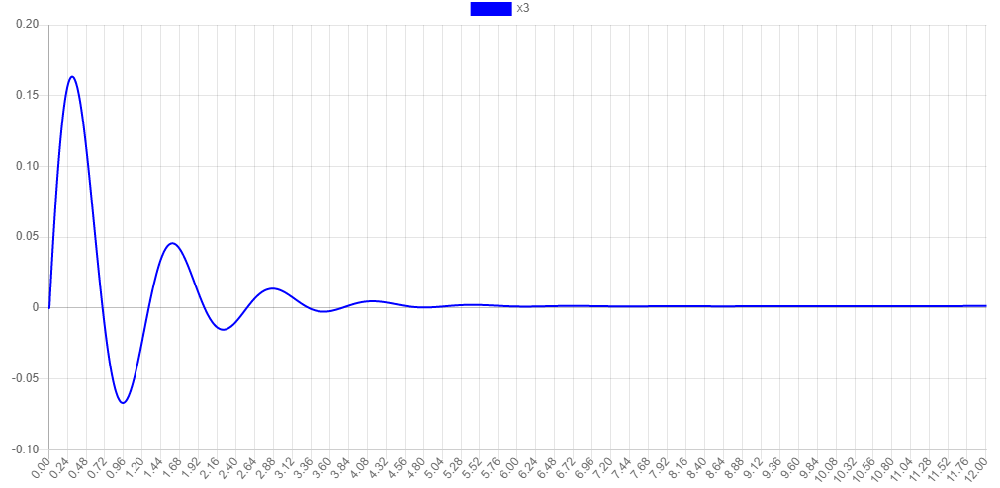
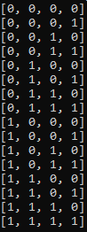
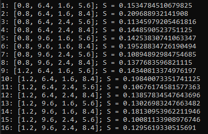
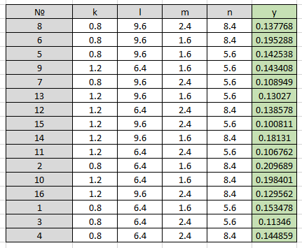
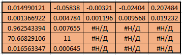
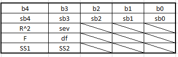
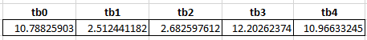
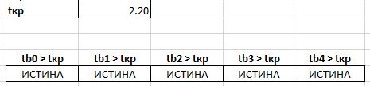

# Проведение ПФЭ (вычислительного эксперимента) и обработка его результатов методом регрессионного анализа

## Задане
В соответствии с индивидуальным вариантом задания:
1.	Используя компьютерную модель, разработанную на основе математической модели, представленной в лабораторной работе № 2, провести активный эксперимент по выявлению зависимости площади криволинейной трапеции, образуемой переменной x3 от первых четырех параметров исходных данных. Диапазон варьирования факторов ± 20% от заданного.
2.	Составить матрицу планирования 2^4. Провести рандомизацию опытов.
3.	Результаты вычислительного эксперимента обработать методом регрессионного анализа в MS Excel (Анализ данных - Регрессия). 
4.	Сделать выводы о вкладе первых четырех параметров исходных данных в величину площади криволинейной трапеции, образуемой переменной x3.

### Математическая модель (см. задание на 2 лабу)  

 

### График полученной функции x3  

 

## Решение

### Диапазоны варьирования факторов для первых 4 парамметров
k = 1 (20% k = 0.2)  
k.min = 0.8  
k.max = 1.2

l = 8 (20% l = 1.6)  
l.min = 6.4  
l.max = 9.6

m = 2 (20% m = 0.4)  
m.min = 1.6  
m.max = 2.4

n = 7 (20% n = 1.4)  
n.min = 5.6  
n.max = 8.4

 

### Матрица планирования для линейнной регрессии
В данной матрице значения в ячейках могут быть либо -1, либо 1. Значение -1 соответствует минимальному значению фактора; значение 1 - максимальному. Для дальнейшего удобства пусть вместо значения -1 будет использоваться значение 0  

<strong>Матрица с 0 и 1</strong>  
  

<strong>Матрица "замапленная" на мин./макс. значения факторов;</strong>  
<strong>Значения площади криволинейной трапеции, образуемой переменной x3 для соотвествующих значений факторов</strong>  
  

Площадь рассчитывалась с помощью метода трапеций (https://ru.wikipedia.org/wiki/Метод_трапеций)

 

### Данные, занесенные в Excel (предварительно перемешанные)
  

 

### Результат встроенной Excel функции "ЛИНЕЙН"
  

В приведенной ниже таблице показано, в каком порядке рассчитываются значения дополнительной регрессионной статистики.  
  

величина | описание
--- | --- 
bi | i-ый коэффициент регрессии
sbi | дисперсия i-ого коэффициента регрессии
R^2 | коэффициент детерминации
sev | стандартная ошибка регрессионных остатков
F | значимость уравнения регрессии
df | степень свободы (n - k - 1)
SS1 | сумма квадратов регрессии 
SS2 | сумма квадратов остатков 

 

## Выводы
Какая доля вариации зависимой переменой обусловлена влиянием включенных в модель факторов?  
<strong>Коэффициент детерминации R^2 = 0.96</strong>  
Он показывает, что около <strong>96%</strong> вариации зависимой переменной обусловлено влиянием включенных факторов, а оставшиеся <strong>4%</strong> обусловлено влиянием других, не учтенных в модели, факторов.  

 

Какова значимость уравнения регрессии? <strong>Fв = 70,69</strong>  
По таблице критических точек распределения Фишера по уровню значимости <strong>0.05</strong> и числу степеней свободы <strong>f1 = k = 4</strong>, <strong>f2 = n - k - 1 = 11</strong> определяем <strong>Fкр = 3.35669002113259</strong>:  
Т.к. <strong>Fв > Fкр</strong>, то получаемое уравнение регрессии значимо, т.е. хотя бы один из коэффициентов   не равен нулю.  

 

Стандартная ошибка регрессионных остатков <strong>sev = 0.007655</strong>  

 

Значимость коэффициентов регрессии  

  
По таблице критических точек распределения Стьюдента по уровню значимости <strong>0.05</strong> и числу степеней свободы <strong>f1 = k = 4</strong> определяем <strong>tкр = 2.20</strong>  

<strong>Оценка значимости коэффициентов регрессии (критерия Стьюдента)</strong>  
  

<strong>Все коэффициенты регрессии значимы!</strong>  